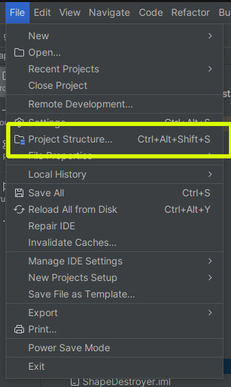
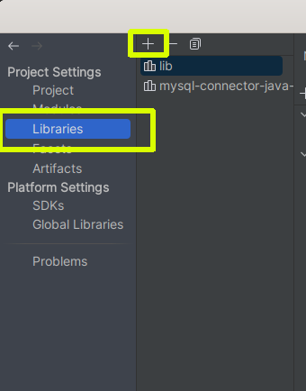
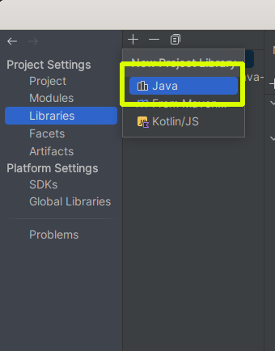
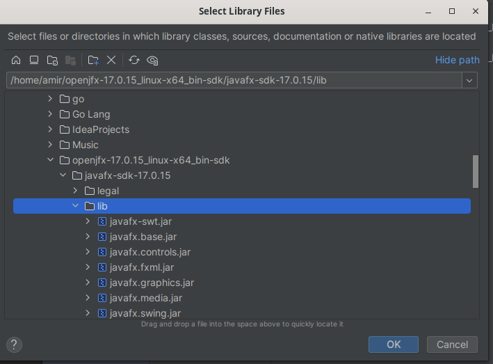
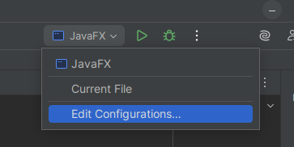
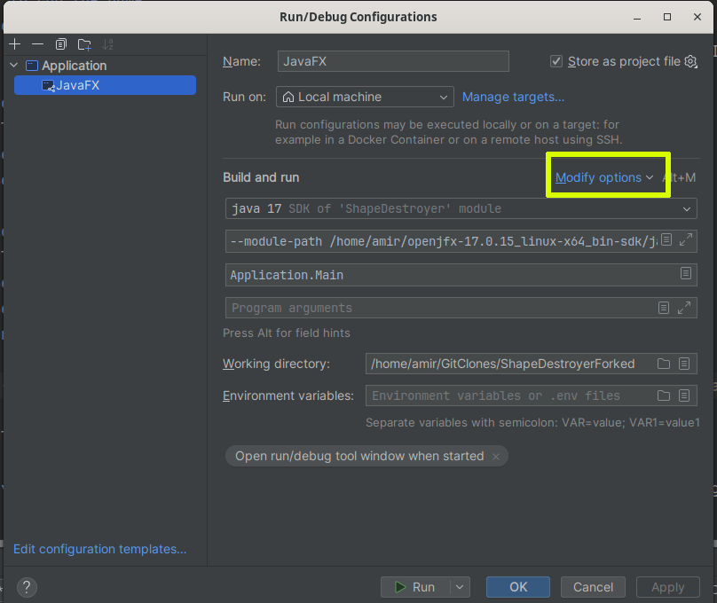
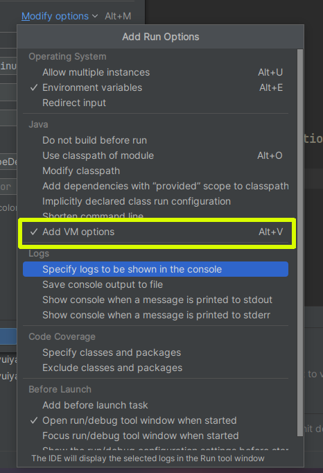

# ShapeDestroyer-Game

This is an Desktop Game application made with JavaFX.
Here how to run it:

# Pre-requisites
1. Install IntelliJ IDEA IDE installed on your machine. (Community Edition is enough)
2. Make sure you have Java Development Kit (JDK) installed on your machine. (JDK 17 or higher is recommended)
3. Make sure you have JavaFX SDK downloaded(version 17 recommended). You can download it from [Gluon](https://gluonhq.com/products/javafx/).

# Steps to run the game
1. Clone the repository or download the source code.
2. Open the downloaded/cloned project folder with IntelliJ IDEA (Because it is the IDE I used to develop this game).

3. Go to `File` -> `Project Structure` -> `Libraries`.
    - Click on the `+` button to add a new library.
    - Select `Java` and navigate to the `lib` folder of the JavaFX SDK you downloaded.
    - Select all the `.jar` files in the `lib` folder and click `OK`.

   

   

   

   

4. Go to `Run` -> `Edit Configurations`.
    - Click on the `+` button to add a new configuration.
    - Select `Application`.
    - Set the `Main class` to `Application.Main`
    - In the `VM options` field, add the following line (adjust the path to your JavaFX SDK):(Go to `Modify Options` in run configuration and select `Add VM Options` if not available)
      ```
      --module-path "/path_to_your_javaFx_'lib'_folder" --add-modules javafx.controls,javafx.fxml
      ```
    - Click `Apply` -> `OK` to save the configuration.

   
   
   
   
   
   
5. Now you can run the game by clicking the `Run` button in IntelliJ IDEA or by pressing `Shift + F10`.

